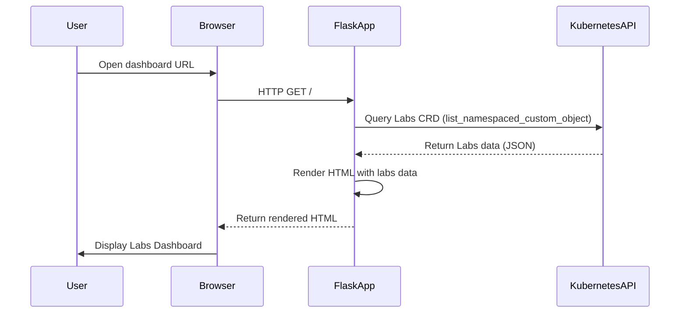

# Kubernetes Labs Dashboard

A web-based dashboard for managing and visualizing Kubernetes lab environments.

## How it Works: Sequence Diagram


## Features

- View and manage Kubernetes resources
- User-friendly interface for lab environments
- Real-time status updates

## Getting Started

1. Clone the repository:
    ```bash
    git clone https://github.com/yourusername/kubernetes-labs-dashboard.git
    ```
2. Follow the setup instructions on how to start.


## How to Start

1. (Optional but recommended) Create and activate a Python virtual environment:
    ```bash
    python3 -m venv venv
    source venv/bin/activate
    ```
2. Install dependencies:
    ```bash
    pip install -r requirements.txt
    ```
3. Start the development server:
    ```bash
    python labs-dashboard.py
    ```
4. Open your browser and navigate to `http://localhost:5000`.

## Build and run with Docker

1. Build the Docker image:
    ```bash
    docker build -t kubernetes-labs-dashboard .
    ```
2. Run the container:
    ```bash
    docker run -p 8080:8080 -v ~/.kube:/root/.kube kubernetes-labs-dashboard
    ```
3. Open your browser and navigate to `http://localhost:8080`.

## Build and run with Docker

1. Build the Docker image:
    ```bash
    docker build -t kubernetes-labs-dashboard .
    ```
2. Run the container:
    ```bash
    docker run -p 8080:8080 -v ~/.kube:/root/.kube kubernetes-labs-dashboard
    ```
3. Open your browser and navigate to `http://localhost:8080`.

## Build and run with Podman

1. Build the image:
    ```bash
    podman build -t kubernetes-labs-dashboard .
    ```
2. Run the container:
    ```bash
    podman run -p 8080:8080 -v ~/.kube:/root/.kube:Z kubernetes-labs-dashboard
    ```
3. Open your browser and navigate to `http://localhost:8080`.

## License

MIT License